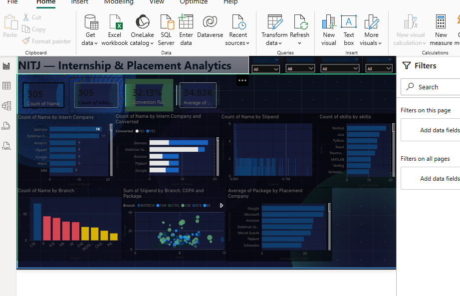
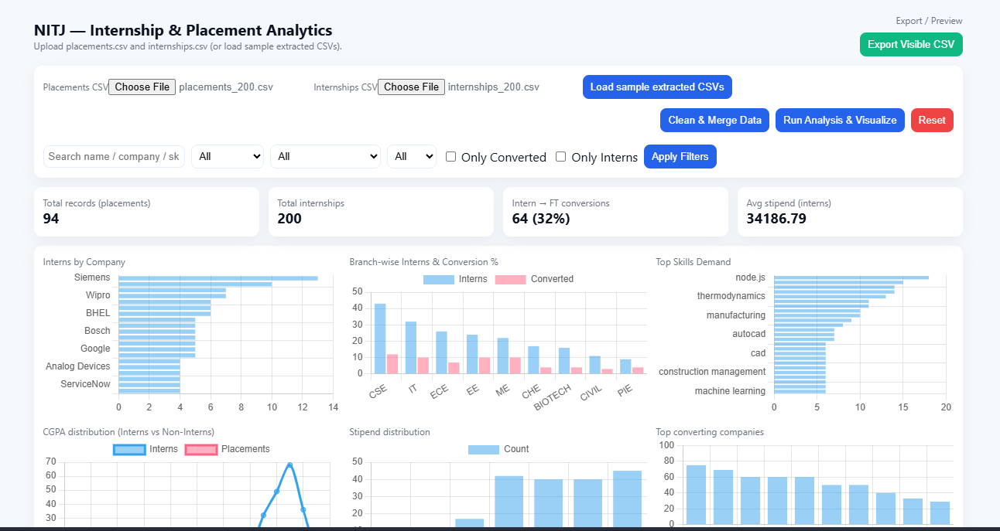
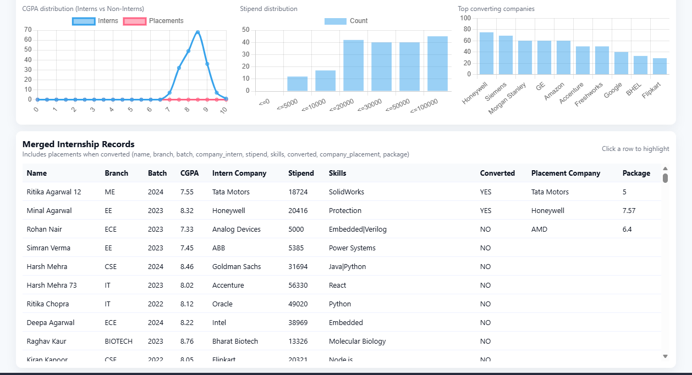

# 📊 Placement Analytics Dashboard

## Overview
A data analytics project to study placement and internship trends using Power BI and supporting datasets.

---

## Objective
- Analyze placement trends  
- Study internship impact on placements  
- Identify company hiring patterns  
- Visualize insights using dashboards  

---

## Features
- Cleaned placement and internship datasets  
- Power BI dashboard for analysis  
- Company-wise hiring insights  
- Internship vs placement comparison  
- Simple HTML prototype dashboard  

---

## Tools Used
- Power BI  
- HTML  
- CSV / Excel datasets  
- Python (data processing)  

---

## Project Structure
```
placement-analytics-dashboard/
│
├── data/
├── powerbi/
├── web-dashboard/
├── screenshots/
└── README.md
```

---

## Screenshots

### Dashboard Overview


### Placement Analysis


### Web Prototype


---

## Results
- Placement trends visualized across branches  
- Internship experience impact identified  
- Top recruiting companies highlighted  

---

## Author
Chunchu Navadeep  
---

## Note
This project is for academic and learning purposes.
